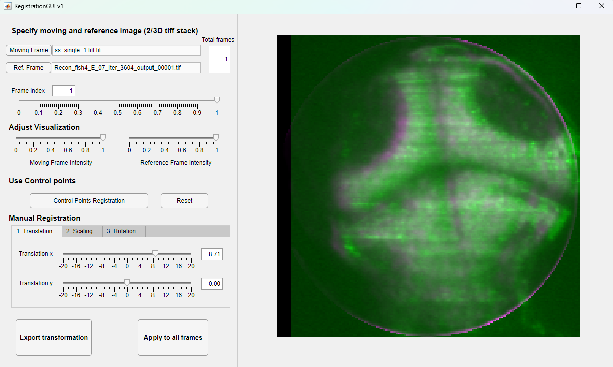

## Matlab app for image registration

Image registration based on Matlab's control points and affine transformation. It previews the results and supports manual adjustment via image translation, scaling and rotation. 

It only supports 2D affine transformation. If two image stacks are chosen, the same transformation will be applied to all slices. 

## Usage

Specify files (2D/3D tiff/tif), choose frame/slice index, registration via control points and/or manual tranformation, output registered results. 

## Installation

Use the Matlab app installer in this repository.